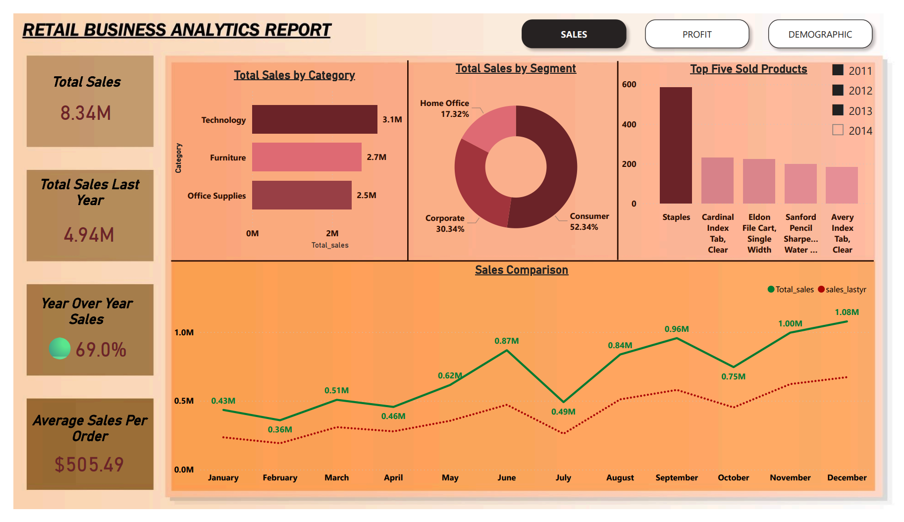
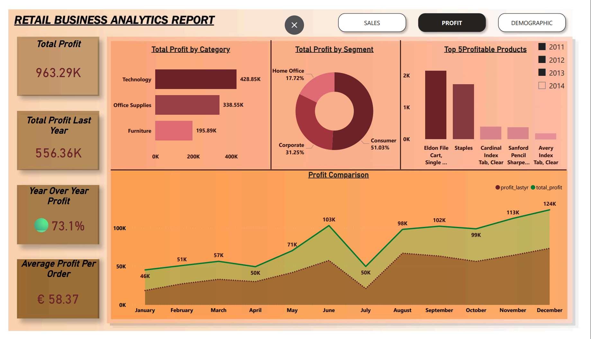
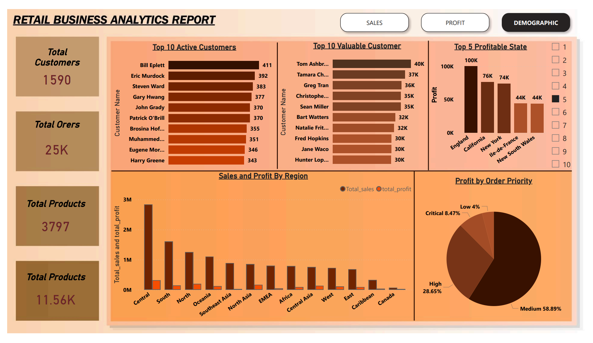

# 🛍️ Retail Business Analytics Dashboard

## 📊 Project Overview
This project analyzes retail data to uncover insights on **sales, profit, and customer behavior**.  
Built using **Power BI**, the dashboard helps track performance, identify trends, and support data-driven decisions.

---

## 🎯 Objectives
- Track **sales and profit performance**
- Identify **top products and categories**
- Analyze **customer segments and regions**
- Monitor **year-over-year growth**

---

## 🛠️ Tech Stack
- **Power BI** → Visualization & dashboard  
- **Python / Excel** → Data cleaning  
- **SQL** → Data querying  

---

## 📈 Key Insights

### 💰 Sales
- Total Sales: **8.34M**  
- YoY Growth: **69%**  
- Top Category: **Technology**  
- Consumer segment contributes the most  

### 📊 Profit
- Total Profit: **963K**  
- YoY Growth: **73.1%**  
- Technology is the most profitable category  

### 👥 Customers
- Total Customers: **1,590**  
- Top regions: **England, California, New York**  
- Majority orders fall under **Medium priority**  

---

## 📊 Dashboard Features
- Sales, Profit, and Demographic views  
- Category & segment analysis  
- Monthly trend comparison  
- Top products & customers insights  

---

## 🚀 How to Use
1. Clone the repository  
2. Open the `.pbix` file in Power BI  
3. Explore using filters and visuals  

---

## 📸 Dashboard Preview

### 📌 Sales Dashboard

### 📌 Profit Dashboard

### 📌 Demographic Dashboard

